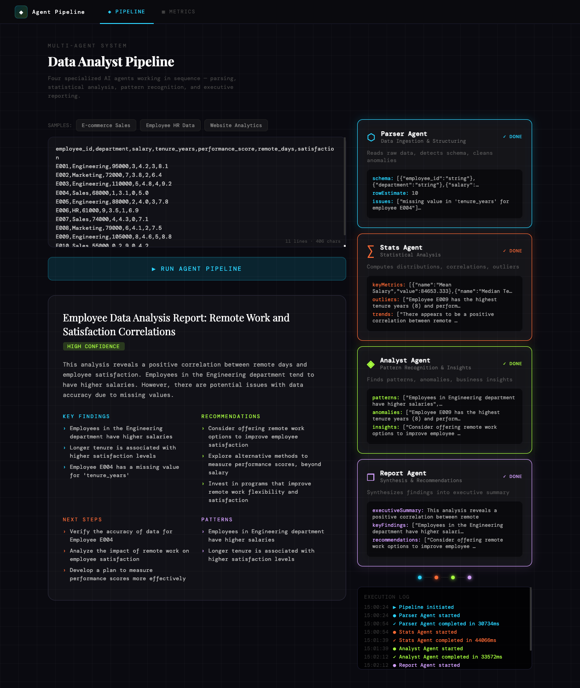
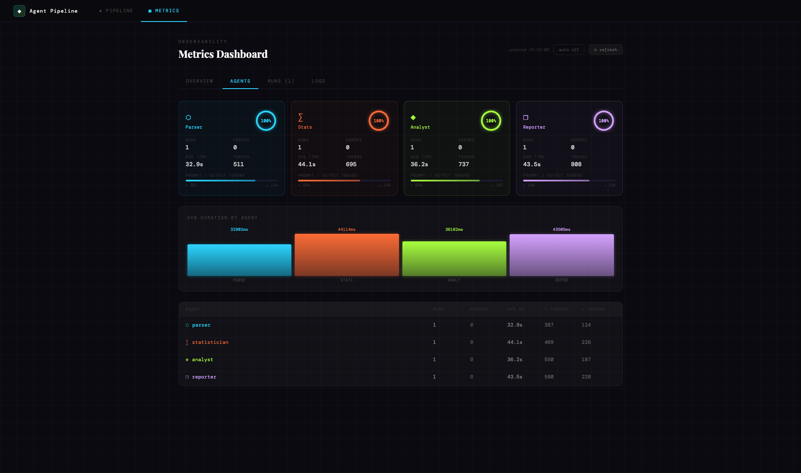

# 🤖 Data Analyst Agents

A full-stack multi-agent AI application that analyzes datasets using a sequential pipeline of four specialized AI agents — **running entirely locally via [Ollama](https://ollama.com). No cloud API keys required.**



## 📂 File Tree

```
data-analyst-agents/
├── api/                   # Node.js + Express + TypeScript backend
│   └── src/
│       ├── agents/
│       │   ├── definitions.ts   # Agent prompts & metadata
│       │   ├── runner.ts        # Ollama HTTP client (no SDK needed)
│       │   └── pipeline.ts      # Sequential orchestrator (SSE)
│       ├── middleware/
│       │   └── errorHandler.ts
│       ├── routes/
│       │   └── pipeline.ts      # REST + SSE endpoints
│       ├── types/
│       │   └── index.ts
│       └── index.ts             # Express app entry point
│
└── frontend/              # React + TypeScript + Vite frontend
    └── src/
        ├── components/    # AgentCard, PipelineLog, ResultPanel
        ├── hooks/         # usePipeline (all state logic)
        ├── services/      # api.ts (SSE client), samples.ts
        ├── types/
        └── App.tsx
```

---

## 🚀 Getting Started

### 1. Install & start Ollama

Download from **https://ollama.com** then pull a model:

```bash
# Recommended models (pick one):
ollama pull llama3.2        # fast & lightweight (~2 GB)
ollama pull mistral         # excellent JSON output (~4 GB)
ollama pull qwen2.5:14b     # very capable (~9 GB)
ollama pull deepseek-r1:8b  # reasoning model (~5 GB)
```

Ollama runs as a background service at `http://localhost:11434` automatically after install.

### 2. Set up the API

```bash
cd api
npm install
cp .env.example .env      # edit OLLAMA_MODEL if needed
npm run dev               # → http://localhost:3001
```

On startup the API will print whether Ollama is reachable:

```
✅  API running at http://localhost:3001
   Ollama URL:    http://localhost:11434
   Default model: llama3.2
   Ollama:        ✅ reachable
```

### 3. Set up the Frontend

```bash
cd frontend
npm install
npm run dev               # → http://localhost:5173
```

---

## 🔌 API Endpoints

| Method   | Path                | Description                           |
| -------- | ------------------- | ------------------------------------- |
| `GET`    | `/api/health`       | Health check + Ollama connectivity    |
| `GET`    | `/api/agents`       | List all agents (no system prompts)   |
| `GET`    | `/api/models`       | List locally pulled Ollama models     |
| `POST`   | `/api/pipeline/run` | Run full pipeline (SSE stream)        |
| `GET`    | `/api/metrics`      | Aggregated usage statistics           |
| `GET`    | `/api/runs`         | Recent pipeline run records           |
| `GET`    | `/api/runs/:runId`  | Single run detail + per-agent metrics |
| `GET`    | `/api/logs`         | In-memory structured log buffer       |
| `DELETE` | `/api/logs`         | Clear log buffer                      |

### POST `/api/pipeline/run`

```json
{
  "data": "your CSV or JSON data...",
  "model": "mistral"
}
```

`model` is optional — omitting it uses the `OLLAMA_MODEL` env var.

**Response:** `text/event-stream`

```
data: {"agentId":"parser","status":"running","message":"...","timestamp":"..."}
data: {"agentId":"parser","status":"done","result":{...},"timestamp":"..."}
...
data: {"type":"pipeline_complete","results":{...},"timestamp":"..."}
```

### GET `/api/models`

```json
{
  "success": true,
  "activeModel": "llama3.2",
  "models": [
    { "name": "llama3.2", "size": 2019393189, "modifiedAt": "..." },
    { "name": "mistral", "size": 4109865159, "modifiedAt": "..." }
  ]
}
```

---

## 📊 Observability



### GET `/api/metrics`

Returns aggregated stats across all pipeline runs since server start:

```json
{
  "metrics": {
    "totalPipelineRuns": 12,
    "completedRuns": 11,
    "failedRuns": 1,
    "avgPipelineDurationMs": 18400,
    "totalInputBytes": 48200,
    "totalPromptTokensEst": 142000,
    "totalOutputTokensEst": 9800,
    "byModel": { "llama3.2": 8, "mistral": 4 },
    "recentErrorRate": 5.0,
    "uptimeSec": 3600,
    "byAgent": [
      {
        "agentId": "parser",
        "totalRuns": 12,
        "successRuns": 12,
        "errorRuns": 0,
        "avgDurationMs": 3200,
        "totalPromptTokensEst": 28000,
        "totalOutputTokensEst": 1800
      }
    ]
  }
}
```

### GET `/api/runs?limit=20`

Returns the most recent pipeline run records. Each run includes per-agent timing, token estimates, status, and client IP.

### GET `/api/runs/:runId`

Full detail for a single run — useful for debugging a specific pipeline execution.

### GET `/api/logs?level=info&limit=100&since=<ISO>`

Returns buffered log entries. All log entries are structured JSON with `id`, `ts`, `level`, `msg`, and optional `ctx` (context object).

Query params:

- `level` — minimum level: `debug | info | warn | error`
- `limit` — max entries to return (default 100, max 500)
- `since` — ISO datetime, returns only entries at or after this time

```json
{
  "logs": [
    {
      "id": "uuid",
      "ts": "2024-01-01T12:00:00.000Z",
      "level": "info",
      "msg": "Agent completed",
      "ctx": { "runId": "...", "agentId": "parser", "durationMs": 3210 }
    }
  ]
}
```

`DELETE /api/logs` clears the in-memory buffer.

---

## 🤖 The Agent Pipeline

```
Input Data
    │
    ▼
⬡  Parser Agent        → schema, data quality, anomalies
    │
    ▼
∑   Stats Agent         → metrics, trends, correlations
    │
    ▼
◈   Analyst Agent       → patterns, insights, risks
    │
    ▼
❐   Reporter Agent      → executive summary + recommendations
```

Each agent receives the raw data **plus all prior agents' outputs**, so findings compound through the pipeline. The `format: "json"` Ollama parameter ensures each agent always returns parseable JSON.

---

## ⚙️ Environment Variables

| Variable          | Default                  | Description                               |
| ----------------- | ------------------------ | ----------------------------------------- |
| `OLLAMA_BASE_URL` | `http://localhost:11434` | Ollama server URL                         |
| `OLLAMA_MODEL`    | `llama3.2`               | Default model for all agents              |
| `PORT`            | `3001`                   | API server port                           |
| `NODE_ENV`        | `development`            | Environment                               |
| `FRONTEND_URL`    | `http://localhost:5173`  | Allowed CORS origin                       |
| `LOG_LEVEL`       | `info`                   | Min log level: `debug\|info\|warn\|error` |

---

## 🏗️ Production Build

```bash
cd api && npm run build
cd frontend && npm run build   # → frontend/dist/
```
